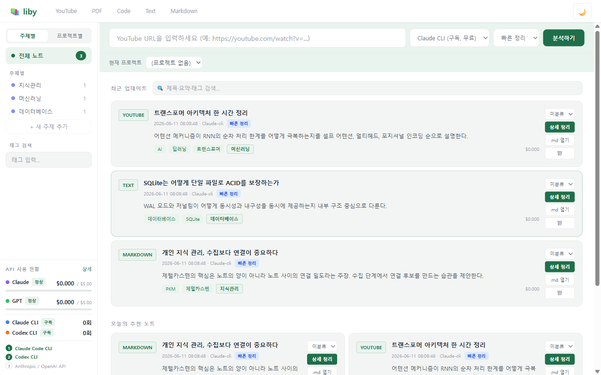
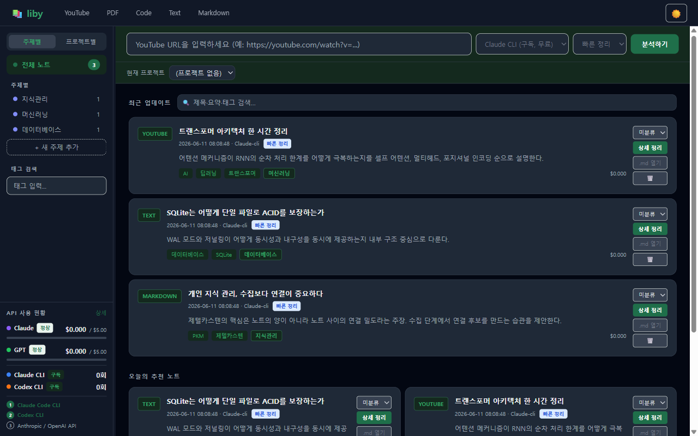

# liby

> YouTube URL, PDF, 텍스트, 코드를 붙여넣으면 AI가 구조화된 요약 노트를 만들어 주는, 내가 소유하는 로컬 웹 지식 라이브러리.

[English](README.md) | **한국어**



<details>
<summary>다크 모드</summary>


</details>

## 주요 기능

- **다양한 입력 소스** — YouTube(자막 자동 추출, yt-dlp), PDF(PyMuPDF), 일반 텍스트, Markdown, 코드
- **2단계 요약 모드** — 빠른 요약(quick)과 챕터·인용·각주가 포함된 상세 요약(detailed)
- **YouTube 타임라인 연동** — 요약 문단의 타임스탬프 클릭 시 임베드 플레이어가 해당 지점으로 이동
- **프로젝트/토픽 관리** — 노트를 프로젝트·토픽으로 묶고 프로젝트 다이제스트 생성
- **AI 프로바이더 교체 가능** — Anthropic API, OpenAI API, 또는 동봉된 [agent-runner-bridge](bridge/README.md)를 통한 **본인 구독**(Claude Pro / ChatGPT Plus) 인증 — API 과금 없음
- **비용 가드** — 프로바이더별 월간 사용액 한도 및 사용량 대시보드
- **Discord 봇 연동(선택)** — 폰에서 Discord 메시지로 분석을 트리거하고, Tailscale로 결과 열람 ([운영 가이드](docs/operations-discord-tailscale.md))
- **Obsidian 친화적 저장** — 모든 노트는 SQLite + `vault/`의 Markdown 파일로 저장

## 시작하기 (Docker)

```bash
git clone <this-repo>
cd liby
cp .env.example .env
```

### 방법 A — API 키

`.env`에 `DEFAULT_AI_PROVIDER=claude`(또는 `gpt`)와 해당 API 키를 설정한 뒤:

```bash
docker compose up --build liby
```

브라우저에서 http://127.0.0.1:8000 접속.

### 방법 B — 본인 구독 (Claude Pro / ChatGPT Plus)

**본인 계정**으로 로그인한 Claude Code / Codex CLI로 분석합니다 — API 과금 없음. 인증 정보는 저장소·이미지에 포함되지 않고 각 사용자가 로컬에서 주입합니다.

1. 호스트에 CLI 설치 후 1회 로그인: `claude` (또는 `codex`)
2. 인증 정보를 (gitignore된) 마운트 디렉토리로 복사:
   - Windows: `pwsh ./bridge/scripts/sync-creds.ps1`
   - macOS/Linux: `./bridge/scripts/sync-creds.sh`
3. `.env`의 `BRIDGE_TOKEN`에 임의의 긴 문자열을 넣고:

```bash
docker compose up --build
```

`docker compose up` 한 번으로 liby와 bridge가 함께 뜨고, liby는 내부 네트워크로 bridge에 자동 연결됩니다.
구독 토큰이 만료/갱신되면 `sync-creds`를 다시 실행하세요. 반드시 **본인 계정**만 사용하세요.

### 수동 설치 (Docker 없이)

```bash
python -m venv .venv
# Windows: .venv\Scripts\activate / macOS·Linux: source .venv/bin/activate
pip install -r requirements.txt
python -m uvicorn main:app --port 8000
```

선택: YouTube 챕터 스크린샷용 `ffmpeg` 설치.

## .env 설정

전체 항목과 설명은 [.env.example](.env.example) 참고.

| 프로바이더 | `DEFAULT_AI_PROVIDER` | 필요 설정 |
|-----------|----------------------|----------|
| Anthropic API | `claude` | `ANTHROPIC_API_KEY` |
| OpenAI API | `gpt` | `OPENAI_API_KEY` |
| Claude Code CLI (구독) | `claude-cli` | `BRIDGE_TOKEN` + sync-creds |
| Codex CLI (구독) | `codex-cli` | `BRIDGE_TOKEN` + sync-creds |

## 기술 스택

| 레이어 | 기술 |
|--------|------|
| 백엔드 | Python 3.11+, FastAPI |
| 프론트엔드 | Jinja2 + HTMX + Tailwind CSS (빌드 단계 없음) |
| 저장소 | SQLite(`liby.db`) + Markdown 파일(`vault/`) |
| AI | Anthropic Claude / OpenAI GPT / CLI bridge(구독) |

## 테스트

```bash
python -m pytest          # liby (외부 호출 전부 모킹 — 키 불필요)
cd bridge && npm test     # bridge
```

## 프로젝트 구조

```
main.py            # FastAPI 앱 진입점 (worker + Discord 봇 lifespan)
config.py          # .env 기반 설정
models.py          # SQLite 스키마/초기화
routers/           # API 라우터 (youtube, pdf, text, code, items, projects, ...)
services/          # 추출·요약·태스크 큐·Discord 봇
services/ai/       # AI 프로바이더 추상화 (claude / openai / bridge / fallback)
templates/         # Jinja2 + HTMX 템플릿
bridge/            # agent-runner-bridge (구독 인증 CLI 게이트웨이)
scripts/           # demo_seed.py 등 유틸리티
vault/             # 생성된 Markdown 노트 (gitignore)
docs/              # 설계 스펙·구현 계획·운영 가이드
```

## 라이선스

[MIT](LICENSE)
